[简体中文](README.md) | **English**

<picture>
  <source media="(max-width: 640px) and (prefers-color-scheme: dark)" srcset="assets/presentation/hero-mobile-dark.svg">
  <source media="(max-width: 640px)" srcset="assets/presentation/hero-mobile-light.svg">
  <source media="(prefers-color-scheme: dark)" srcset="assets/presentation/hero-dark.svg">
  
</picture>

**agentq collects coding-agent approval requests in a local browser queue and returns each choice to the waiting session.**

`Go 1.24+ · Python 3 demo` · [Apache-2.0](LICENSE) · [GitHub](https://github.com/SuperMarioYL/agentq) · [Website](https://agentq.lei6393.com)

## Why it helps

Parallel sessions can leave approval prompts scattered across terminals. agentq collects ApprovalEnvelopes with session labels, choices and context, then returns the answer to the original requester. You still decide which requests to approve.

<picture>
  <source media="(max-width: 640px) and (prefers-color-scheme: dark)" srcset="assets/presentation/process-mobile-dark.svg">
  <source media="(max-width: 640px)" srcset="assets/presentation/process-mobile-light.svg">
  <source media="(prefers-color-scheme: dark)" srcset="assets/presentation/process-dark.svg">
  
</picture>

## Architecture

wrap recognizes child-process prompts and produces ApprovalEnvelopes. With --daemon it forwards requests over local HTTP. serve persists envelopes and answers in bbolt and exposes the queue through REST, WebSocket and an embedded page. attach generates an access URL and QR code. Plain wrap also supports the stdin/stdout protocol.

<picture>
  <source media="(max-width: 640px) and (prefers-color-scheme: dark)" srcset="assets/presentation/architecture-mobile-dark.svg">
  <source media="(max-width: 640px)" srcset="assets/presentation/architecture-mobile-light.svg">
  <source media="(prefers-color-scheme: dark)" srcset="assets/presentation/architecture-dark.svg">
  
</picture>

## Install

Requires Go 1.24+ and Python 3 for the supplied protocol demo. Building may download Go dependencies; the demo only contacts loopback.

```bash
git clone https://github.com/SuperMarioYL/agentq.git
cd agentq
go build -o agentq ./cmd/agentq
```

## Quickstart

```bash
python3 examples/presentation_demo.py
```

The script builds and starts the real daemon in a temporary directory, submits one constructed approval and answers n over HTTP. The queue moves from zero to demo-approval, the answer returns to the requester, and the queue returns to zero. It launches no coding agent and executes no action described in the prompt.

## Usage

```bash
# Start or reuse the local daemon and forward approvals
./agentq wrap --daemon -- claude

# Explicitly expose the queue on your local network
./agentq serve --lan --token-out ./agentq-token.txt
./agentq attach --token-file ./agentq-token.txt

# Select the Cursor/Aider prompt matcher
./agentq wrap --daemon --agent cursor -- cursor-agent
```

Install third-party commands separately. The phone must be able to reach the host. serve binds to 127.0.0.1 by default; generating a QR code does not make a loopback listener reachable over LAN.

## Capabilities and integrations

| Route | Behavior |
|---|---|
| POST /api/envelopes | Submit and wait for an answer or expiry |
| GET /api/queue | Read pending requests |
| POST /api/queue/:id/answer | Submit choice_key |
| /ws | Subscribe to queue and answer events |
| GET /schema/approval-envelope.json | Fetch the public protocol schema |
| GET /healthz | Check liveness |

/api and /ws accept a bearer token or ?t=token. Custom runtimes can call the protocol directly instead of using prompt recognition.

<picture>
  <source media="(max-width: 640px) and (prefers-color-scheme: dark)" srcset="assets/presentation/integrations-mobile-dark.svg">
  <source media="(max-width: 640px)" srcset="assets/presentation/integrations-mobile-light.svg">
  <source media="(prefers-color-scheme: dark)" srcset="assets/presentation/integrations-dark.svg">
  
</picture>

## Configuration and limits

| serve option | Default/purpose |
|---|---|
| --listen | 127.0.0.1:7777 |
| --lan | Explicitly listen on all interfaces |
| --data-dir | XDG_DATA_HOME/agentq or ~/.agentq |
| --token | Generated when omitted |
| --token-out | Write the active token to a file |
| --auto-approve | Repeatable glob:choice rules |
| --auto-approve-file | One rule per line |

Automatic approval is off by default. Rules match the whole prompt in order; * spans /. The first match applies only if its choice exists in the current envelope, otherwise human triage remains. This is text matching, not command-safety analysis. wrap --expiry controls validity; prompt recognition depends on the selected output format and cannot guarantee capture of unknown interactions.

## Recorded demo

A real local HTTP round trip on v0.11.0. The example extracts stable fields from actual responses, omitting dynamic timestamps. It is not phone, LAN or third-party agent compatibility acceptance.

[Inputs, commands and complete output](docs/demo-results.json)

[Retained terminal recording](assets/demo.gif) · [Recording script](docs/demo.tape). The replayable record above describes this example.

## Roadmap

- [x] stdio envelopes/answers and prompt matchers.
- [x] Daemon, bbolt, REST, WebSocket and browser queue.
- [x] wrap --daemon, QR access and explicit LAN binding.
- [x] Optional automatic-approval rules.
- [ ] Expanded team collaboration and audit experience.

See CHANGELOG.md for shipped fixes. Validate the particular third-party agent version used by your integration.

## Development and license

```bash
go test ./...
go build ./cmd/agentq
```

See [approval.go](internal/protocol/approval.go) and the [JSON Schema](docs/approval-envelope.schema.json) for the protocol.

[Apache-2.0](LICENSE) · [Issues](https://github.com/SuperMarioYL/agentq/issues)
