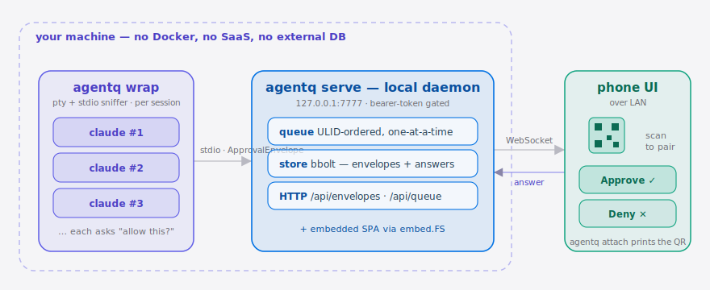

# agentq

[English](./README.en.md) | **简体中文**

<p align="center">
  
</p>

<p align="center">
  <a href="./LICENSE"></a>
  <a href="https://go.dev/"></a>
  <a href="https://github.com/SuperMarioYL/agentq/releases"></a>
  <a href="#"></a>
  <a href="#"></a>
</p>

> **agentq 把 N 个并行 Claude Code 会话的审批请求收敛到同一个手机队列。**

## 目录

- [为什么需要它](#为什么需要它)
- [10 秒上手](#10-秒上手)
- [演示](#演示)
- [架构](#架构)
- [HTTP / WebSocket API](#http--websocket-api)
- [配置](#配置)
- [对比 affaan-m/everything-claude-code](#对比-affaan-meverything-claude-code)
- [路线图](#路线图)
- [协议与贡献](#协议与贡献)
- [Share this](#share-this)

## 为什么需要它

你在 tmux 里同时开了 4 个 Claude Code 会话，每个都会停下来问"允许这条 bash 吗？""可以改这个文件吗？"——但你不知道**当前哪一个**在等你。alt-tab 一圈才找到要回答的那个，写代码的时间被切碎成了"找窗口 → 点 Yes → 找下一个窗口"的循环。社区里这叫 **George Jetson 时刻**——见 [r/LocalLLaMA 上的原帖](https://www.reddit.com/r/LocalLLaMA/comments/1tuth0k/)，以及 [affaan-m/everything-claude-code](https://github.com/affaan-m/everything-claude-code) 里围绕多 Claude Code 会话整理的工作流。

agentq 把这件事翻转过来：审批不再绑死在终端窗口里，而是聚拢成手机上的一个**有序队列**。哪个 Agent 在等你，扫一眼就知道；按一下就放它过去。

## 10 秒上手

```bash
# 安装（任选其一）
brew install SuperMarioYL/tap/agentq          # macOS
go install github.com/SuperMarioYL/agentq@latest

# 终端 A：起守护进程，记下打印的 token
agentq serve

# 每个 Agent 终端：用 wrap 套住 Agent
agentq wrap -- claude
# Cursor / Aider 等用括号式 (Y)es/(N)o 提示的 Agent：
agentq wrap --agent cursor -- cursor-agent   # --agent 默认 auto，同时识别两种提示

# 桌面终端：打印手机扫码（LAN IP 选错时用 --ip 手动指定）
agentq attach --token <粘 token>
```

扫码、点 Approve、Agent 解锁——首次审批一般在两分钟以内完成。

##  演示


> 动图由 CI（[`.github/workflows/demo.yml`](./.github/workflows/demo.yml)）用 [vhs](https://github.com/charmbracelet/vhs) 渲染脚本 [docs/demo.tape](./docs/demo.tape) 自动产出。

##  架构

<p align="center">
  <picture>
    <source media="(prefers-color-scheme: dark)" srcset="./assets/atlas-dark.svg">
    <source media="(prefers-color-scheme: light)" srcset="./assets/atlas-light.svg">
    
  </picture>
</p>

每个 Claude Code 会话被 `agentq wrap`（很薄的 pty + stdio 嗅探器）套住，识别审批提示后以 `ApprovalEnvelope` JSON 上报给本地的 `agentq serve` 守护进程。守护进程把信封按 ULID 顺序排成一个一次只放一个的队列，用 bbolt 持久化，并在 `127.0.0.1:7777` 上同时提供 HTTP、WebSocket 与内嵌 SPA。`agentq attach` 算出本机 LAN IP 打印二维码，手机扫码后即可排空队列，每条答复沿 WebSocket 回传解锁对应的 Agent——全程在你自己的机器上，没有 Docker、没有 SaaS、没有外部数据库。

三个进程都跑在你自己的机器上：
- `agentq wrap`：很薄的 pty + stdio 嗅探器，识别 Agent 的审批提示，按 `ApprovalEnvelope` JSON 上报；
- `agentq serve`：单文件 Go 二进制，绑定 `127.0.0.1:7777`，提供 HTTP + WebSocket + 内嵌 SPA；
- `agentq attach`：算出本机 LAN IP，把 `http://<ip>:7777/?t=<token>` 编成终端二维码。

没有 Docker、没有 SaaS、没有外部数据库。

## HTTP / WebSocket API

| 路由 | 方法 | 作用 |
| ---- | ---- | ---- |
| `/api/envelopes` | POST | 发送 `ApprovalEnvelope`，长连接阻塞直到拿到答复（或 TTL 到期） |
| `/api/queue` | GET | 列出当前未答复的 envelope，按 ULID 升序 |
| `/api/queue/:id/answer` | POST | 提交 `{ "choice_key": "y" }` |
| `/ws` | WebSocket | 推送 `{kind:"envelope"}` / `{kind:"answer"}` 事件，初次连接会推送当前快照 |
| `/healthz` | GET | 无需 token 的存活检查 |

所有 `/api` 和 `/ws` 都要求 `?t=<token>` 或 `Authorization: Bearer <token>`。

`ApprovalEnvelope` 的字段在 [internal/protocol/approval.go](./internal/protocol/approval.go) 里定义；公开它是 agentq 的护城河——任何 Agent 运行时都能直接发同样的信封，绕过 stdio 拦截。

## 配置

| 字段 | 类型 | 默认值 | 含义 |
| ---- | ---- | ------ | ---- |
| `--listen` | host:port | `127.0.0.1:7777` | 守护进程监听地址 |
| `--lan` | bool | `false` | 把 `--listen` 改成 `0.0.0.0:<port>`，让手机能进来 |
| `--data-dir` | path | `$XDG_DATA_HOME/agentq` 或 `~/.agentq` | bbolt 文件所在目录 |
| `--token` | string | 自动生成 | 客户端必须带的 bearer token |
| `--token-out` | path | 不写 | 把 token 写到文件，`attach` 可用 `--token-file` 读 |

`agentq wrap` 沿用 m1 已实现的 stdout/stdin 协议，可以通过外部桥脚本把每行 envelope POST 给守护进程；与 `wrap` 内置 daemon 模式的集成会在 v0.1.1 合入。

## 对比 affaan-m/everything-claude-code

[affaan-m/everything-claude-code](https://github.com/affaan-m/everything-claude-code) 是一份围绕 Claude Code 工作流的精选清单，定位是"资源整理"；agentq 解决的是清单里至今缺席的**多会话审批收敛**问题。两者并不冲突——把 agentq 放到清单里反而是好事。

| 维度 | agentq | everything-claude-code |
| ---- | ------ | ---------------------- |
| 多会话审批收敛 N→1 | ✓ | — |
| `ApprovalEnvelope` 开放协议 | ✓ | — |
| 工作流资源精选 | — | ✓ |
| 单二进制工具 | ✓ | — |
| 适用于多 Agent 并行 | ✓ | partial |

## 路线图

- [x] m1：wrap 单 Agent，stdout/stdin 驱动
- [x] m2：N 个 wrap → 一个 daemon，bbolt 持久化，REST + WS
- [x] m3：手机端响应式 SPA + 终端二维码
- [x] v0.2：Cursor / Aider 适配器（`agentq wrap --agent cursor`）；修复审批竞态丢失、ULID 非单调乱序、attach 选错 LAN IP 三个缺陷
- [ ] v0.3：Windows 支持；`Team` 模式（共享队列 + 审计日志），按需付费

## 协议与贡献

MIT。问题、想法、协议讨论一律走 [Issues](https://github.com/SuperMarioYL/agentq/issues)；想加新 Agent 适配器就直接发 PR，`ApprovalEnvelope` 一旦公开就是大家的协议。

推送仓库后建议加 topic：

```bash
gh repo edit --add-topic claude-code --add-topic agent --add-topic mcp
```

## Share this

```
agentq —— 把 N 个并行 Claude Code 会话的审批塞进一个手机队列。开源、单二进制、30 秒上手。Agent 多了 alt-tab 找不到哪个在等你？扫码就行。 https://github.com/SuperMarioYL/agentq
```
